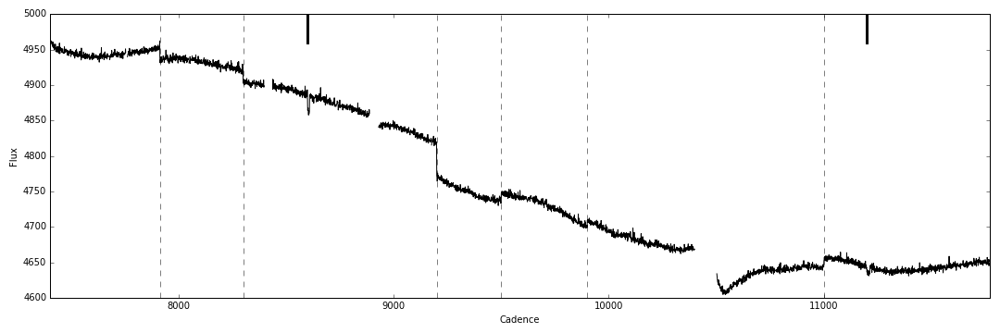

# Oxford Kepler jump and systematics correction pipeline

A pipeline to a) detect, classify, and remove isolated discontinuities
from Kepler light curves; b) and remove the systematics trends from
the light curves using public co-trending basis vectors (CBV),
variational Bayes, and shrinkage priors.

The pipeline consists of a Python package and two scripts:

`KeplerJC` (Kepler Jump Correction) is a Python package to detect,
classify, and remove isolated discontinuities from individual Kepler
light curves.

The code models the Kepler light curve as a Gaus sian Process, scans
the light curve for discontinuities, and classifies the
discontinuities using simple BIC-based model selection between a jump,
transit, and flare.

## Description
This module uses the co-trending basis vectors (CBVs) derived by the
Kepler PDC-MAP pipeline and published on the MAST archive to detrend
individual Kepler light curves. Like the PDC-MAP pipeline, each light
curve is modelled as a linear combination of CBVs. However, here this
model is implemented in a Variational Bayes (VB) framework, where the
priors over the weights associated with each CBV are optimized to
mximse the marginal likelihood of hte model. Because we use zero-mean
Gaussian priors for the weights, with hyper-priors on the widths of
those priors centred on zero, any CBV not strongly supported by the
data is not used in the final model. This approach, known as automatic
relevance determination (ARD) or shrinkage, reduces the risk of
overfitting. As the CBVs are derived from the Kepler light curves and
contain some noise, it also reduces the amount of noise injected into
the light curves by the correction, including on planetary transit
(few hour) timescales. Finally, it also preserves intrinsic stellar
variability more successfully than the standard PDC-MAP pipeline.

For more info, see Aigrain, Parvianen, Roberts & Evans (in prep.). An
older version of our Kepler systematics correction, using the same
VB-ARD framework, but our own basis vector discovery, was described in
Roberts, McQuillan, Reece & Aigrain (2013).

## Dependencies
numpy, pylab, pyfits, argparse

## Installation
Simply clone the repo and place it in your Python path. 

## Usage
See the notebook example1.ipynb in the examples directory.

## TBD
- implement recipe for selecting number of CBVs used automatically
- demonstrate use of "exclude_func" keyword to mask specific regions
  of the light curve during the CBV fitting process.

Installation
------------
Clone the code from GitHub

    git clone https://github.com/hpparvi/KeplerJC.git

and install

    cd KeplerJC
    python setup.py install [--user]

Jump detection and correction
-----------------------------
    from keplerjc import KData, JumpFinder, JumpClassifier

    kdata = KData(cadence, flux, quality)

    jf = JumpFinder(kdata)
    jumps = jf.find_jumps()

    jc = JumpClassifier(kdata, jf.hp)
    jc.classify(jumps)

    kdata.plot(jumps)

The figure above is reproduced in the `Example_1` IPython notebook under the `examples` directory. Discontinuities identified as jumps are marked with slashed vertical lines, while transit-like features are marked as thick vertical lines spanning the upper part of the figure.

Authors
-------

- Hannu Parviainen
- Suzanne Aigrain
